# mrkdwn.me — Feature Roadmap

A chronological record of every feature shipped in mrkdwn.me.

---

## Core Platform

### Vault System — Feb 17, 2026
Multi-vault architecture with Clerk authentication and Convex real-time backend.
Each user can create multiple vaults, each containing its own notes and folder hierarchy.

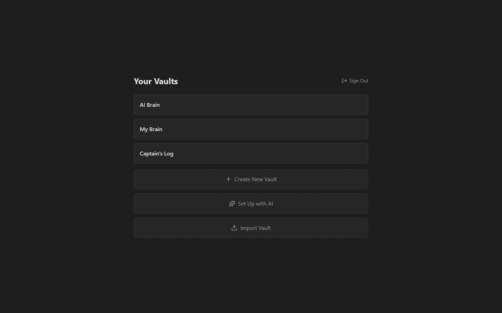

### Markdown Editor (CodeMirror 6) — Feb 17, 2026
Full-featured markdown editor built on CodeMirror 6 with syntax highlighting, live preview decorations, and auto-save.
Supports headings, bold/italic, inline code, blockquotes, task checkboxes, horizontal rules, and tags — all rendered inline.

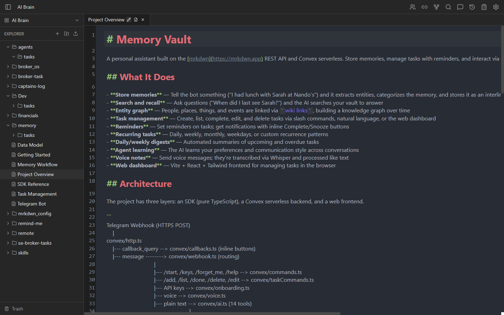

### File Explorer — Feb 17, 2026
Sidebar file tree with nested folders, drag-and-drop reorganization, and context menus for rename/delete.
Notes and folders are displayed alphabetically with intuitive navigation.

### Wiki Links & Backlinks — Feb 17, 2026
`[[Wiki Link]]` syntax with alias (`[[Title|Alias]]`) and heading (`[[Title#Heading]]`) support.
Backlinks panel shows all notes linking to the current note, plus unlinked mentions of the note's title.

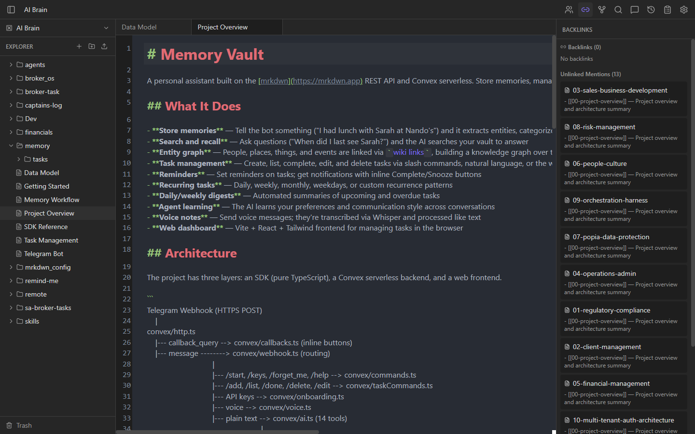

### Wiki Link Autocomplete — Feb 17, 2026
Typing `[[` in the editor triggers a dropdown of matching note titles from the current vault.
Filtered in real-time by substring matching as you type, with no network request (uses in-memory note list).

### Graph View — Feb 18, 2026
Interactive force-directed graph visualization of all notes and their wiki link connections.
Originally in the right panel, later moved to open as an editor tab for a larger canvas.

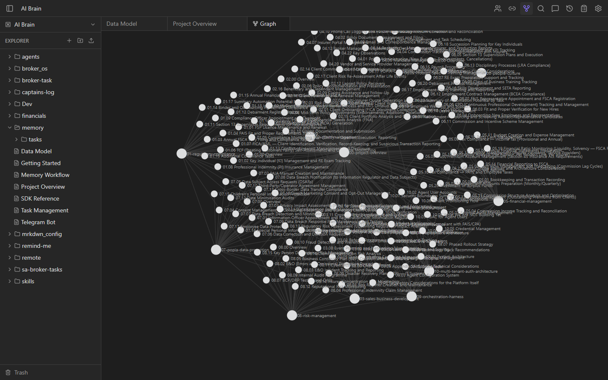

### Search & Command Palette — Feb 17, 2026
`Ctrl/Cmd + P` opens a fuzzy-search command palette for quickly finding and opening notes.
Also provides access to app commands like toggling preview mode, exporting, and switching vaults.

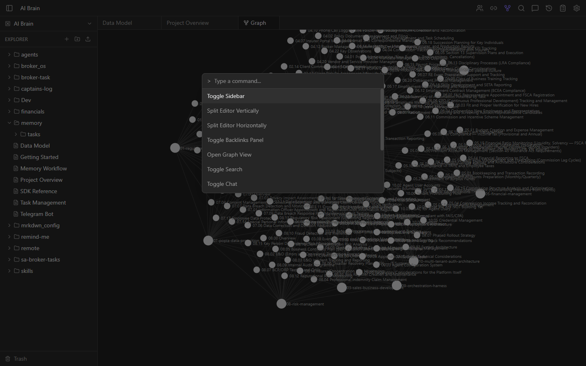

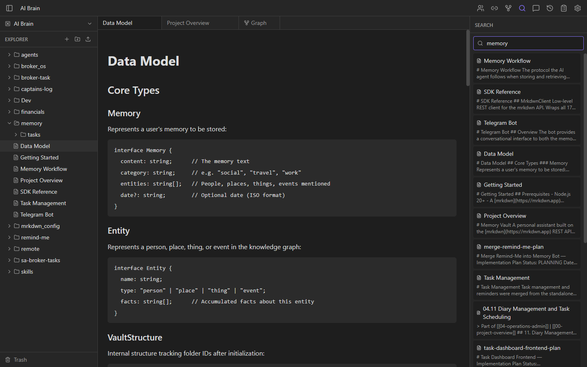

### Workspace & Tabbed Layout — Feb 17, 2026
Multi-tab workspace where each tab independently tracks its note and preview/edit mode.
State managed via React Context + useReducer with actions for opening, closing, and reordering tabs.

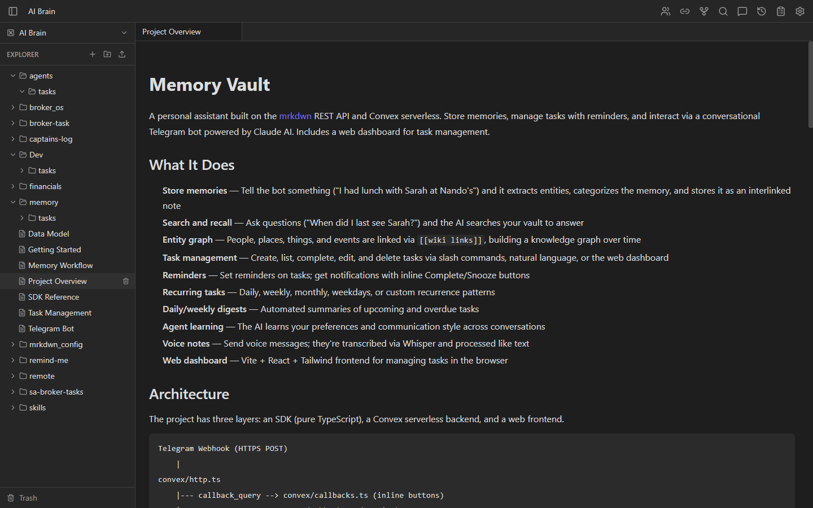

### Authentication (Clerk) — Feb 17, 2026
User authentication via Clerk with JWT validation on every Convex backend function.
Supports sign-up, sign-in, and session management with secure per-user data isolation.

### Real-Time Sync (Convex) — Feb 17, 2026
Live subscriptions via Convex ensure all data (notes, folders, backlinks) updates instantly across tabs.
External changes (e.g., wiki link renames) reflect in the editor without page reload.

---

## Feb 18, 2026

### Import Vault — Feb 18, 2026
Migrate an existing Obsidian vault by uploading a ZIP file; folder structure and markdown content are preserved.
Handles nested directories, special characters in filenames, and large vaults.

### Preview / Edit Mode Toggle — Feb 18, 2026
Notes open in read-only rendered markdown preview by default; toggle to CodeMirror edit mode via double-click, keyboard shortcut (`Ctrl/Cmd + E`), or tab icon.
Each tab remembers its mode independently.

### Vault Switcher — Feb 18, 2026
Dropdown in the sidebar header for switching between vaults without leaving the app.
Switching vaults resets the workspace tabs and file explorer to the new vault's contents.

### Download Vault as ZIP — Feb 18, 2026
Export the entire vault (notes and folder structure) as a `.zip` file for local backup or migration.
Reconstructs the folder hierarchy as directories and writes each note as a `.md` file.

### AI Onboarding Wizard — Feb 18, 2026
Guided vault creation powered by OpenRouter LLMs — answers a series of questions about your use case, then generates a starter vault with folders and notes.
Provides a structured starting point instead of a blank vault.

---

## Feb 19, 2026

### PDF Export — Feb 19, 2026
Export any single note as a styled PDF document via `html2pdf.js` and `marked`.
Wiki links and tags are stripped to plain text; tables, code blocks, and blockquotes are formatted for print.

### Markdown File Upload — Feb 19, 2026
Upload `.md` files directly into an existing vault from the file explorer.
Notes are created with the filename as the title and the file contents as markdown.

### AI Chat Edit Mode — Feb 19, 2026
Chat with an LLM (via OpenRouter) to edit notes using natural language instructions.
Shows a diff view of proposed changes before applying, with accept/reject controls.

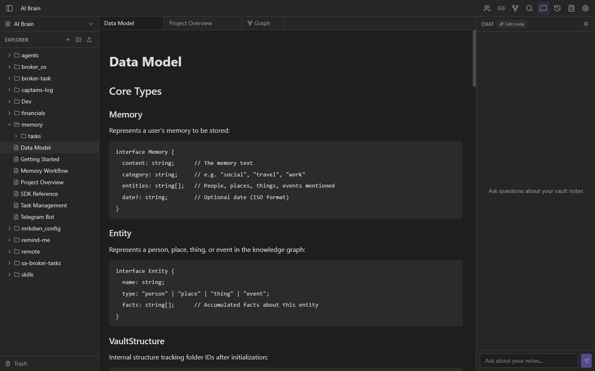

---

## Feb 24, 2026

### OpenRouter API Key Settings — Feb 24, 2026
User settings dialog for entering and testing an OpenRouter API key.
Includes a one-click test button that validates the key against the OpenRouter API.

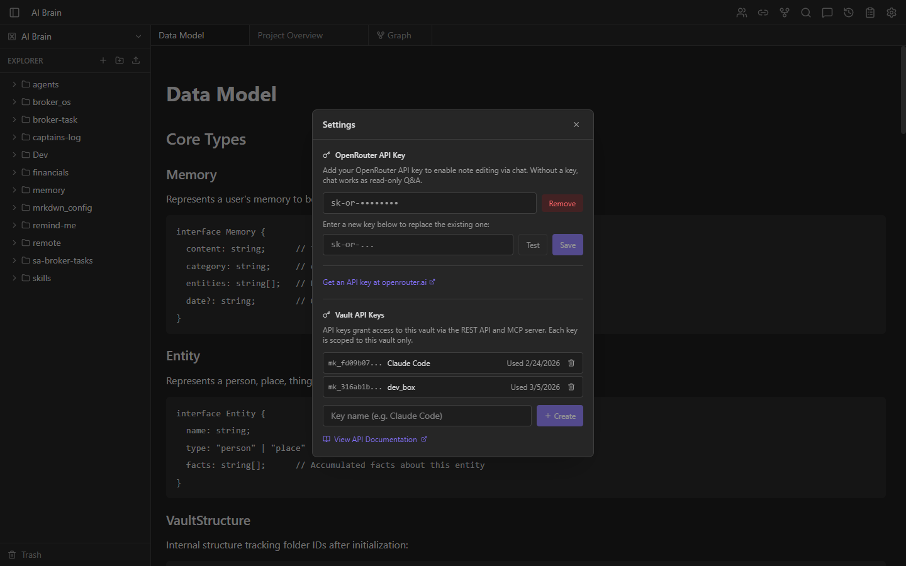

### Public REST API v1 — Feb 24, 2026
Full CRUD HTTP API for vaults, folders, and notes at `/api/v1/`.
Enables programmatic access for automation, integrations, and third-party tools.

### Per-Vault API Key Auth — Feb 24, 2026
Generate unique API keys per vault for authenticating REST API and MCP server requests.
Keys are hashed server-side; each vault can have its own access credential.

### MCP Server — Feb 24, 2026
Model Context Protocol server (`@mrkdwn/mcp-server`) for AI tool access to vaults.
Enables LLMs like Claude to read, search, create, and edit notes via the REST API.

---

## Feb 26, 2026

### Alphabetical File Explorer Sorting — Feb 26, 2026
File explorer items (notes and folders) are now sorted alphabetically at each level of the tree.
Provides a consistent, predictable ordering that matches user expectations.

---

## Feb 28, 2026

### Delete Confirmation Dialogs — Feb 28, 2026
Deleting a folder now shows a confirmation dialog warning about recursive child deletion.
Prevents accidental data loss from misclicks in the file explorer.

### Folder Drag-and-Drop Cycle Prevention — Feb 28, 2026
Dragging a folder into itself or one of its descendants is now blocked.
Prevents orphaned folders caused by circular parent references.

### Public API Documentation Page — Feb 28, 2026
Interactive API docs available at `/docs` within the app, documenting all REST API v1 endpoints.
Includes request/response examples, authentication details, and error codes.

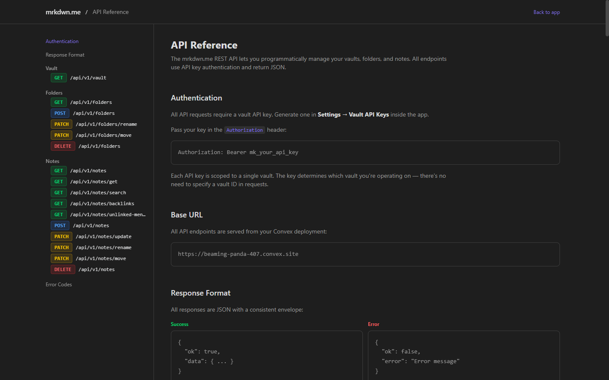

---

## Mar 3, 2026

### Link Preview Popup on Wiki Link Hover — Mar 3, 2026
Hovering over a `[[wiki link]]` in either editor or preview mode shows a popup with the linked note's rendered markdown content.
Popup appears at the mouse cursor with smart viewport edge detection — flips direction near screen edges and dismisses cleanly on click or mouse-out.

### Markdown Rendering in Chat Messages — Mar 3, 2026
AI chat responses are now rendered as formatted markdown (headings, bold, lists, code blocks) instead of plain text.
`[[Wiki links]]` in responses are clickable and navigate to the referenced note. Both chat modes instruct the AI to use wiki link syntax when citing notes.

### Concise Chat Responses — Mar 3, 2026
AI chat responses are now brief (1-3 sentences) with `[[wiki links]]` to source notes, letting users click through for details.
Longer responses are only produced when the user explicitly asks for detail.

### Vault Sharing — Mar 3, 2026
Multi-user vault sharing with three roles: Owner, Editor, and Viewer. Owners invite collaborators by email; invitees see pending invitations on the vault selector and accept to gain access. Editors get full CRUD on notes and folders; viewers see everything read-only with the editor locked to preview mode. Shared vaults appear in a separate "Shared with You" section on the vault selector. Includes a sharing management dialog for owners, role badges throughout the UI, and permission-gated controls (file explorer, tab bar, command palette, drag-and-drop). Also fixes a security gap where the chat endpoints did not verify vault access.

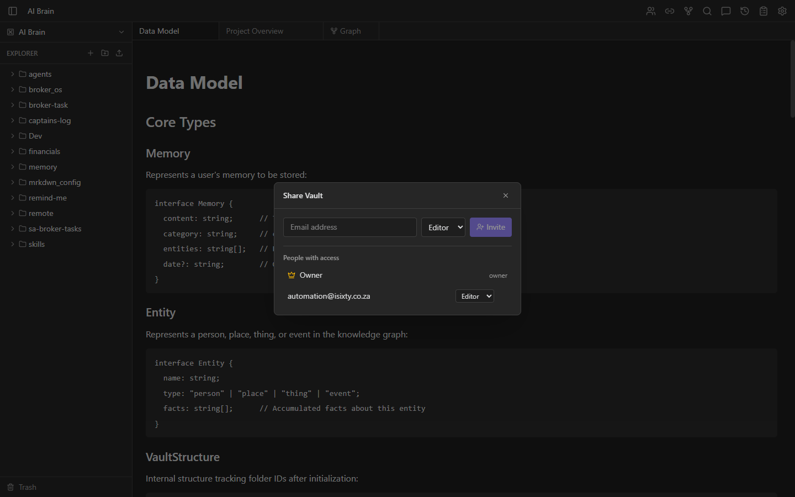

### Chat Endpoint Security Fix — Mar 3, 2026
The `/api/chat` and `/api/chat-edit` httpAction endpoints now verify the authenticated user has access to the requested vault before building context. Previously, any authenticated user who knew a vault ID could query its notes. Q&A mode requires viewer access; edit mode requires editor access.

---

## Mar 4, 2026

### Audit Log — Mar 4, 2026
Every mutation that modifies notes or folders records an audit entry with user attribution, action type, target info, and metadata.
Queryable by vault (newest first) or by specific target. Viewable from a toolbar button in a filterable modal dialog.

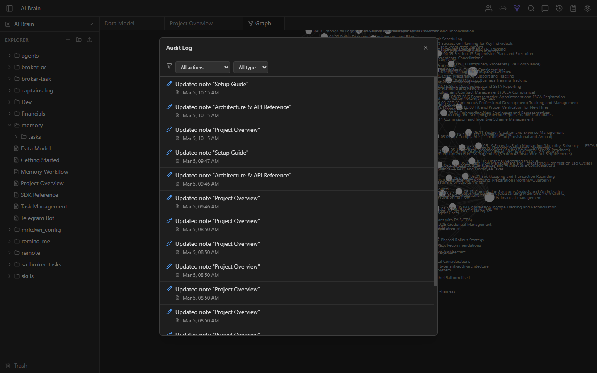

### Note Version History — Mar 4, 2026
Automatic point-in-time snapshots of note content, throttled to max 1 per 5 minutes on content edits.
Rename, move, and delete always create a snapshot. Versions are viewable and restorable from a right-panel History view.

### Soft Delete & Trash — Mar 4, 2026
Notes and folders are soft-deleted instead of permanently removed. Deleted items are retained for up to 5 years and appear in a Trash panel in the sidebar.
Folder deletion cascades to all descendants. Items can be restored (editor+) or permanently deleted (owner only). A daily cron purges items older than 5 years.

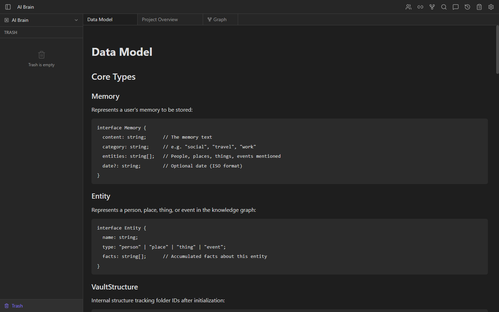

---

## Mar 5, 2026

### Audit Logging & Version History for REST API / MCP Server — Mar 5, 2026
All mutations through the REST API v1 and MCP server now record audit log entries and create version snapshots, matching the behavior of the frontend.
The API key owner's identity is used for user attribution. Internal mutations accept an optional `userId` parameter passed from the API auth layer.
